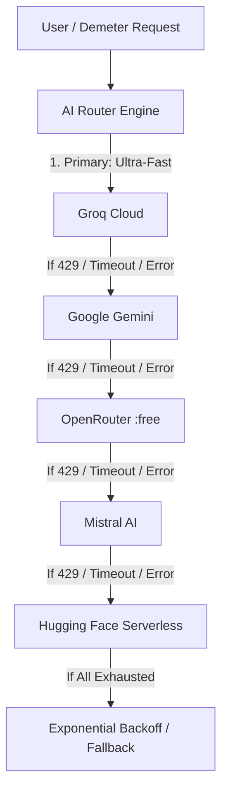

# DEM3T3R V1 & DEMETER - Multi-Provider Free AI API Architecture

A production-ready, zero-cost, high-availability multi-provider AI routing system designed for autonomous agricultural robotics, crop disease diagnostics, and interactive AI advisors.

---

## 🌟 Architecture & Priority Fallback Chain

The AI Router automatically attempts providers in strict priority order, seamlessly failing over upon rate limits (HTTP 429), timeouts, or API errors:



| Priority | Provider | Key Endpoint | Default Free Models |
| :--- | :--- | :--- | :--- |
| **1 (Primary)** | **Groq** | `https://api.groq.com/openai/v1` | `qwen/qwen3.8-27b`, `llama-3.3-70b-versatile`, `llama-3.1-8b-instant` |
| **2 (Secondary)** | **Google Gemini** | `https://generativelanguage.googleapis.com/v1beta` | `gemini-flash-lite-latest`, `gemini-flash-latest`, `gemini-2.0-flash-exp` |
| **3 (Fallback 1)** | **OpenRouter** | `https://openrouter.ai/api/v1` | `meta-llama/llama-3.3-70b-instruct:free`, `deepseek/deepseek-r1:free` |
| **4 (Fallback 2)** | **Mistral AI** | `https://api.mistral.ai/v1` | `mistral-small-latest`, `open-mistral-7b`, `open-mixtral-8x7b` |
| **5 (Fallback 3)** | **Hugging Face** | `https://api-inference.huggingface.co/v1` | `meta-llama/Llama-3.2-3B-Instruct`, `Qwen/Qwen2.5-72B-Instruct` |

---

## 🔑 Step-by-Step: Obtaining Free API Keys

All keys must be obtained legitimately from provider dashboards. No credit card is required for basic free tiers.

### 1. Groq (Primary)
1. Go to [https://console.groq.com/](https://console.groq.com/) and sign up with Google/GitHub.
2. Navigate to **API Keys** -> Click **Create API Key**.
3. Copy the key starting with `gsk_...`.
4. Paste into `.env` as `GROQ_API_KEY=gsk_...`.

### 2. Google Gemini (Secondary)
1. Go to [https://aistudio.google.com/app/apikey](https://aistudio.google.com/app/apikey).
2. Sign in with your Google account.
3. Click **Create API Key** -> Choose a Google Cloud Project (or create a default one).
4. Copy the key starting with `AIza...`.
5. Paste into `.env` as `GEMINI_API_KEY=AIza...`. (You can also add `GEMINI_API_KEY_2=` and `GEMINI_API_KEY_3=` for multi-key rotation).

### 3. OpenRouter (Fallback 1)
1. Go to [https://openrouter.ai/](https://openrouter.ai/) and sign in.
2. Go to **Settings** -> **Keys** -> Click **Create Key**.
3. OpenRouter provides access to multiple free community models ending with `:free`.
4. Paste into `.env` as `OPENROUTER_API_KEY=sk-or-v1-...`.

### 4. Mistral AI (Fallback 2)
1. Go to [https://console.mistral.ai/](https://console.mistral.ai/) and create an account.
2. Navigate to **API Keys** -> Click **Create New Key**.
3. Mistral offers a free Experiment Tier on La Plateforme.
4. Paste into `.env` as `MISTRAL_API_KEY=...`.

### 5. Hugging Face (Fallback 3)
1. Go to [https://huggingface.co/settings/tokens](https://huggingface.co/settings/tokens).
2. Click **Create new token** -> Select **Read** access.
3. Paste into `.env` as `HUGGINGFACE_API_KEY=hf_...`.

---

## ⚙️ Quick Start Installation

### 1. Clone & Set Up Environment
```bash
cd C:\Users\Pasindu\.gemini\antigravity\scratch\CropGuard

# Copy environment template
cp .env.example .env
```

### 2. Configure Your `.env`
Open `.env` and fill in your keys:
```env
GROQ_API_KEY=gsk_your_groq_key
GEMINI_API_KEY=AIza_your_gemini_key
OPENROUTER_API_KEY=sk-or_your_openrouter_key
MISTRAL_API_KEY=your_mistral_key
HUGGINGFACE_API_KEY=hf_your_hf_token
```

### 3. Install Python Dependencies
```bash
pip install -r requirements.txt
```

### 4. Run the Provider Test Suite
```bash
python test_ai.py
```
Output will display individual provider statuses, masked keys, and verify the automatic failover router.

---

## 💻 Integration Guide (DEMETER / DEM3T3R V1)

### Basic Usage
```python
from ai_router import generate_response

# Simple query
answer = generate_response("Analyze this crop disease detection result and give a recovery plan.")
print(answer)
```

### Advanced Usage with System Prompt & JSON Mode
```python
from ai_router import generate_response

prompt = "Analyze Tomato Late Blight on high humidity fields."
system_prompt = "You are DEMET3R AI agricultural pathologist. Return JSON with 'disease', 'causes', 'recovery_plan'."

# Returns a parsed Python dictionary when json_mode=True
result = generate_response(
    prompt=prompt,
    system_prompt=system_prompt,
    json_mode=True,
    temperature=0.2,
    timeout=10
)

print(result)
```

---

## 🔒 Security & Best Practices

- **Never Commit Secrets:** `.env` is listed in `.gitignore`.
- **Automatic Masking:** All logs mask tokens automatically (e.g. `gsk_3Bgw...Unjc`).
- **Free Tier Awareness:** Free tiers have daily and minute rate limits set by providers. The router gracefully jumps to the next provider whenever a 429 status code is received.
